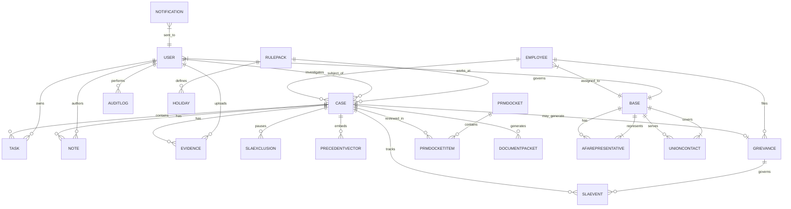

# Labor Relations Investigations & Grievance Management Application

**Comprehensive Requirements — v1.0 (for AI build-out)** *Final consistency check: 19 July 2025*

-----

## 1 · Executive Summary / Purpose

Design and build a modern, secure, and extensible application that manages the full lifecycle of labor-relations investigations and downstream grievances. Phase 1 targets **Flight Attendants (AFA)**, but the architecture must support future unionized workgroups (ALPA, IAM, etc.).

The system will:

* Capture performance, attendance, EEO, discrimination, drug & alcohol, and misconduct cases.
* Enforce contractual **SLA clocks** that are business-day and holiday-aware, with the ability to pause for Leaves of Absence (LOA).
* Preserve the chain of custody on all evidence.
* Drive consistent discipline via AI-powered precedent analytics and a "Seven Tests of Just Cause" reference.
* Provide role-based dashboards for Investigators, Labor Relations, Legal, and Leadership.
* Generate Performance Review Meeting (PRM) agendas and minutes.
* Produce full and *AFA-redacted* investigation packets in PDF within 48 hours of case closure.

-----

## 2 · Scope

### In-Scope (MVP + enrichments)

* Case intake → tasks → notes → evidence → SLA tracking → closure
* Post-disciplinary & contract grievances (with SLA & appeal path)
* PRM docket, snapshots, on-leave hold, recorder minutes
* Knowledge Library (CBA PDFs, policies) with contextual clause hover
* AI assist: similar-case recommender, draft findings, semantic search
* Risk scoring & dashboards
* Role-based security, litigation hold, and a full audit trail
* Configuration-driven Union **Rule Packs**

### Out-of-Scope (future)

* External regulator feeds (FAA, OSHA)
* Non-union employee relations
* Multi-language UI

-----

## 3 · Goals & Success Metrics

| Goal              | Metric                                          | Target   |
| ----------------- | ----------------------------------------------- | -------- |
| SLA Adherence     | % cases on-time vs. contractual deadlines     | ≥ 95 %   |
| Consistency       | Variance of penalties for like-severity cases   | ≤ 10 %   |
| Efficiency        | Avg. days DOK → Disposition (vs. baseline)      | − 20 %   |
| Transparency      | Stakeholder satisfaction (1-5 Likert)           | ≥ 4 / 5  |
| Data Integrity    | Chain-of-custody discrepancies                | 0        |

-----

## 4 · User Roles & Access Rules

| Role                              | Description                                                    | Core Permissions                                                 | Key Views                     |
| --------------------------------- | -------------------------------------------------------------- | ---------------------------------------------------------------- | ----------------------------- |
| **Investigator (Perf. Supervisor)** | Creates + manages FA cases for all bases                       | CRUD Cases/Tasks/Notes/Evidence/SLAEvents; **no** Grievance access | Investigator Dash, Case Workspace |
| **Performance Manager** | Oversees investigators, signs recommendations, RO to grievances | Read all cases & grievances; approve PRM recommendations         | Manager Dash, PRM (RO)        |
| **Labor Relations Analyst** | Owns PRM docket + all grievances                               | Full CRUD Grievances, PRM, SLA Exclusions; read all cases        | Grievance Docket, PRM Admin   |
| **Legal Counsel** | Ensures compliance, litigation                                 | Read all; add Legal Notes; toggle Litigation Hold; approve docs  | Legal Tab, Hold Console       |
| **Senior Leadership** | Union-wide execs                                               | Read cases & grievances in union WG; KPI Dash                    | Exec Dash, PRM (RO)           |
| **Local Leadership** | Base managers                                                  | Read cases at their Base; *no* grievance view                    | Base Dash                     |
| **System Admin** | Config & security                                              | Full meta CRUD, holiday calendars                                | Admin Console                 |
| *(Place-holders)* ALPA / IAM roles | TBD                                                            | TBD                                                              | TBD                           |

### Global Rules

* PRM Docket is read-only for everyone **except** Labor Relations (owner).
* Grievances are read-only for Performance Managers & Senior Leaders and are hidden from Investigators & Local Leaders.
* Data filters: **Union WG** (SR Leaders) · **Base** (Local Leaders).

-----

## 5 · Union Rule Pack Architecture

A **Rule Pack** is a data object configured for each union containing:

* **SLA Steps** – name, trigger, deadline (# business days), description.
* **Holiday/Exclusion Calendar** – list of dates to skip in SLA calculations.
* **Task Templates** – pre-defined tasks that are auto-spawned by violation type.
* **Notice Templates** – merge fields for automated Word/PDF generation.

Rule Packs are editable by a System Admin; swapping a union simply re-references the corresponding pack.

-----

## 6 · AFA Contractual SLA Definitions

| SLA Clock                  | Trigger                              | Deadline (business days) | Notes                               |
| -------------------------- | ------------------------------------ | ------------------------ | ----------------------------------- |
| Disciplinary Notice Window | Company first “reasonably knows” (DOK) | **12** | Exclude weekends & 10 named holidays  |
| Hearing Request Window     | FA receives discipline letter        | **12** |                                     |
| Hearing Scheduling Window  | Co. receives request                 | **10** |                                     |
| Hearing Decision Window    | Hearing concludes                    | **10** |                                     |
| Board of Adjustment Appeal | FA/Union receives decision           | **10** |                                     |
| Contract-Grievance Filing  | FA “knew/should have known”          | **30** | Company response required in 10 days  |

-----

## 7 · Epics & Representative Stories

| #        | Epic                   | User Story                                   | Acceptance Criteria                                                                                    |
| -------- | ---------------------- | -------------------------------------------- | ------------------------------------------------------------------------------------------------------ |
| **7.1.1** | Case Intake & IDs      | Investigator opens new case, gets auto-ID  | Primary `INV-YYYY-NNNN`; secondary `Last,First-EID`; DOK captured then **immutable**.                  |
| **7.1.2** | Union Rules            | AFA timelines surface; ALPA/IAM placeholders | Color-coded SLA bar; rule-pack switch functionality.                                                   |
| **7.1.3** | Auto-Tasks             | Spawn tasks per violation type             | Editable list of tasks.                                                                                |
| **7.1.4** | SLA Exclusions         | Add LOA/sick ranges to pause clocks        | `SLAExclusion` records created; due-dates automatically recalculate.                                   |
| **7.1.5** | Notes & Follow-up      | Timestamped notes w/ categories            | Categories: General, PRM Update, Contact AFA, Interview, Legal, PRM Minutes; Follow-Up flag spawns Task. |
| **7.1.6** | Chain-of-Custody       | Hash + audit every evidence action         | SHA-256 hash generated; all actions logged to an audit table.                                          |
| **7.1.7** | Grievances             | Create Post-Disciplinary & Contract types  | Auto-link to parent case; independent SLA events created.                                              |
| **7.1.8** | Risk Score             | Auto risk ranking for cases                | `Severity` × `Likelihood` × `DaysToDeadline`.                                                          |
| **7.1.9** | PRM Docket             | Generate agenda; hold on-leave cases       | Checkbox moves case to bottom of list, formatted in subtle gray.                                       |
| **7.1.10** | Recorder Notes         | “Add Meeting Note” during PRM              | Note automatically categorized as `PRM Minutes`.                                                       |
| **7.1.11** | Packet Compilation     | Build full & AFA-redacted PDFs             | Doc-type dropdown; blocks case closure until generated; auto-emails Labor.                             |
| **7.1.12** | Case Closure Flow      | 5-stage closure process                    | Stage gating with audits: Recommendation → Accepted → Doc Review → PDF/Close-out → Final Checklist.    |

-----

## 8 · Data Model (Key Entities)

| Entity           | Key Fields (comprehensive)                                                                      |
| ---------------- | ------------------------------------------------------------------------------------------------ |
| **Case** | `CaseID` (PK, GUID), `PrimaryCaseID` (INV-YYYY-NNNN), `SecondaryCaseID` (Last,First-EID), `EmployeeKey`, `EmployeeFirstName`, `EmployeeLastName`, `EmployeeID`, `UnionGroup` (AFA/ALPA/IAM), `ViolationType` (enum), `Severity` (1-5), `Likelihood` (1-5), `Status` (enum), `DOK` (immutable), `IncidentDate`, `ReportedDate`, `InvestigatorID`, `BaseLocation`, `RiskScore` (calculated), `LitigationHold` (bool), `CreatedBy`, `CreatedOn`, `ModifiedBy`, `ModifiedOn` |
| **Task** | `TaskID` (PK, GUID), `CaseID` (FK), `Title`, `Description`, `OwnerID`, `AssignedBy`, `DueDate`, `CompletedDate`, `Status` (enum: Open/InProgress/Completed/Cancelled), `Priority` (enum), `TaskType` (enum), `AutoGenerated` (bool), `CreatedOn`, `ModifiedOn` |
| **Note** | `NoteID` (PK, GUID), `CaseID` (FK), `AuthorID`, `NoteCategory` (enum: General/PRM_Update/Contact_AFA/Interview/Legal/PRM_Minutes), `Subject`, `Body` (rich text), `FollowUpFlag` (bool), `FollowUpDate`, `IsConfidential` (bool), `CreatedOn`, `ModifiedOn` |
| **Evidence** | `FileID` (PK, GUID), `CaseID` (FK), `FileName`, `FileSize`, `MimeType`, `DocType` (enum: Statement/Email/Photo/Video/Audio/Report/Medical/Other), `Hash` (SHA-256), `PrivilegedFlag` (bool), `VirusScanStatus`, `VirusScanDate`, `StorageLocation`, `UploadedBy`, `ChainOfCustodyLog` (JSON), `CreatedOn`, `ModifiedOn` |
| **SLAEvent** | `SLAEventID` (PK, GUID), `ParentID` (Case/Grievance), `ParentType` (enum: Case/Grievance), `EventType` (enum: DisciplinaryNotice/HearingRequest/HearingScheduling/HearingDecision/Appeal/ContractGrievance), `TriggerDate`, `DueDate`, `CompletedDate`, `Status` (enum: Pending/InProgress/Completed/Overdue/Paused), `BusinessDaysAllocated`, `BusinessDaysUsed`, `ExcludedDays`, `CreatedOn`, `ModifiedOn` |
| **SLAExclusion** | `ExclID` (PK, GUID), `ParentCaseID` (FK), `ExclusionType` (enum: LOA/Sick/Holiday/Other), `StartDate`, `EndDate`, `Reason`, `ApprovedBy`, `DocumentationRequired` (bool), `CreatedBy`, `CreatedOn` |
| **Grievance** | `GrievanceID` (PK, GUID), `GrievanceNumber` (auto-generated), `Type` (enum: PostDisciplinary/Contract), `LinkedCaseID` (FK), `EmployeeKey`, `UnionRepresentative`, `FilingDate`, `ResponseDueDate`, `Status` (enum: Filed/UnderReview/Hearing/Decision/Appeal/Closed), `Step` (1-4), `CurrentStepDueDate`, `FinalDecision`, `DecisionDate`, `CreatedBy`, `CreatedOn`, `ModifiedOn` |
| **PrecedentVector** | `VectorID` (PK, GUID), `CaseID` (FK), `Embedding` (float[768]), `EmbeddingModel`, `EmbeddingDate`, `TextContent` (for regeneration), `IsActive` (bool) |
| **RulePack** | `RulePackID` (PK, GUID), `UnionGroup` (AFA/ALPA/IAM), `Version`, `IsActive` (bool), `EffectiveDate`, `ExpirationDate`, `JSONDefinition` (SLA steps, task templates, notice templates), `CreatedBy`, `CreatedOn`, `ApprovedBy`, `ApprovedOn` |
| **Holiday** | `HolidayID` (PK, GUID), `Date`, `Name`, `Description`, `UnionGroup` (nullable - null means all unions), `IsRecurring` (bool), `RecurrencePattern`, `CreatedBy`, `CreatedOn` |
| **AuditLog** | `LogID` (PK, GUID), `EntityType`, `EntityID`, `Action` (enum: Create/Read/Update/Delete/Export/Login), `UserID`, `UserRole`, `Timestamp`, `IPAddress`, `Details` (JSON), `OldValues` (JSON), `NewValues` (JSON) |
| **User** | `UserID` (PK, GUID), `EmployeeID`, `FirstName`, `LastName`, `Email`, `Role` (enum), `UnionGroup`, `BaseLocation`, `IsActive` (bool), `LastLogin`, `CreatedOn`, `ModifiedOn` |
| **Employee** | `EmployeeKey` (PK), `EmployeeID`, `FirstName`, `LastName`, `Email`, `UnionGroup`, `BaseLocation`, `HireDate`, `TerminationDate`, `Status` (enum: Active/LOA/Terminated), `LOAStartDate`, `LOAEndDate`, `LOAReason`, `LastUpdated` |
| **PRMDocket** | `DocketID` (PK, GUID), `MeetingDate`, `MeetingType` (enum: Regular/Special), `Status` (enum: Scheduled/InProgress/Completed), `AgendaGenerated` (bool), `MinutesCompleted` (bool), `CreatedBy`, `CreatedOn` |
| **PRMDocketItem** | `DocketItemID` (PK, GUID), `DocketID` (FK), `CaseID` (FK), `ItemOrder`, `OnLeaveHold` (bool), `Recommendation`, `Decision`, `Notes`, `CreatedOn` |
| **DocumentPacket** | `PacketID` (PK, GUID), `CaseID` (FK), `PacketType` (enum: Full/AFA_Redacted), `GenerationDate`, `Status` (enum: Pending/Generated/Delivered/Failed), `FileLocation`, `GeneratedBy`, `DeliveredTo`, `DeliveryDate` |
| **Notification** | `NotificationID` (PK, GUID), `RecipientID`, `NotificationType` (enum: SLA_Warning/SLA_Overdue/Recommendation_Ready/Packet_Generated/Litigation_Hold), `Channel` (enum: Email/Teams/Dashboard), `Subject`, `Message`, `SentDate`, `Status` (enum: Pending/Sent/Failed), `RelatedEntityID`, `RelatedEntityType` |
| **Base** | `BaseID` (PK, GUID), `BaseCode` (ANC/SEA/PDX/SFO/LAX/SAN/HNL), `BaseName`, `City`, `State`, `Country`, `TimeZone`, `IsActive` (bool), `CreatedOn`, `ModifiedOn` |
| **AFARepresentative** | `RepID` (PK, GUID), `BaseID` (FK), `FirstName`, `LastName`, `Title` (enum: LECP/Representative/Alternate), `Email`, `Phone`, `Mobile`, `OfficeLocation`, `IsActive` (bool), `StartDate`, `EndDate`, `CreatedOn`, `ModifiedOn` |
| **UnionContact** | `ContactID` (PK, GUID), `UnionGroup` (AFA/ALPA/IAM), `ContactType` (enum: LECP/Rep/Grievance_Chair/Safety_Chair), `FirstName`, `LastName`, `Title`, `Email`, `Phone`, `Mobile`, `BaseID` (FK), `Jurisdiction`, `IsActive` (bool), `CreatedOn`, `ModifiedOn` |

### 8.1 · Enhanced Entity-Relationship Diagram (Mermaid)



### 8.2 · Data Validation Rules & Constraints

**Case Entity Rules:**
- `DOK` (Date of Knowledge) is immutable once set
- `PrimaryCaseID` follows strict format: `INV-YYYY-NNNN` (auto-generated)
- `SecondaryCaseID` follows format: `LastName,FirstName-EmployeeID`
- `RiskScore` is calculated field: `Severity × Likelihood × DaysToDeadline`
- `UnionGroup` must match employee's union affiliation
- Case cannot be deleted, only marked as closed/archived

**SLA Event Rules:**
- `TriggerDate` cannot be in the future
- `DueDate` calculated using business days only (excludes weekends + holidays)
- `BusinessDaysUsed` auto-calculated excluding SLA exclusion periods
- SLA events automatically pause during active SLA exclusions

**Evidence Rules:**
- `Hash` (SHA-256) generated automatically on upload
- `VirusScanStatus` must be "Clean" before file is accessible
- `ChainOfCustodyLog` is append-only JSON array
- Privileged documents require additional access controls
- File modifications not allowed (immutable after upload)

**Task Rules:**
- Auto-generated tasks cannot be deleted, only marked complete/cancelled
- `DueDate` must be after creation date
- Task completion requires all dependent tasks to be completed

**Note Rules:**
- Notes with `FollowUpFlag = true` automatically generate follow-up tasks
- PRM Minutes notes are restricted to Labor Relations role
- Legal notes are restricted to Legal Counsel role

**Audit Log Rules:**
- All CRUD operations must be logged
- Export operations must be logged with recipient details
- Audit logs are immutable and retention follows compliance requirements

### 8.3 · Enumeration Definitions

**ViolationType:**
- Performance
- Attendance  
- EEO
- Discrimination
- Drug_Alcohol
- Misconduct
- Safety
- Policy_Violation

**CaseStatus:**
- New
- Investigation
- Evidence_Review
- Recommendation_Pending
- PRM_Scheduled
- PRM_Complete
- Decision_Pending
- Closed
- Archived

**TaskStatus:**
- Open
- In_Progress
- Completed
- Cancelled
- Overdue

**NoteCategory:**
- General
- PRM_Update
- Contact_AFA
- Interview
- Legal
- PRM_Minutes

**DocumentType:**
- Statement
- Email
- Photo
- Video
- Audio
- Report
- Medical
- Policy_Document
- Other

**UserRole:**
- Investigator
- Performance_Manager
- Labor_Relations_Analyst
- Legal_Counsel
- Senior_Leadership
- Local_Leadership
- System_Admin

**SLAEventType:**
- Disciplinary_Notice
- Hearing_Request
- Hearing_Scheduling
- Hearing_Decision
- Board_Appeal
- Contract_Grievance

**NotificationType:**
- SLA_T5_Warning
- SLA_Overdue
- Recommendation_Ready
- Packet_Generated
- Litigation_Hold_Placed

**BaseCode:**
- ANC (Anchorage)
- SEA (Seattle)
- PDX (Portland)
- SFO (San Francisco)
- LAX (Los Angeles)
- SAN (San Diego)
- HNL (Honolulu)

**AFARepresentativeTitle:**
- LECP (Local Executive Council President)
- Representative
- Alternate
- Grievance_Chair
- Safety_Chair

**UnionContactType:**
- LECP
- Representative
- Grievance_Chair
- Safety_Chair
- Benefits_Chair
- Scheduling_Chair

-----

## 8.4 · Critical Business Rules & Data Integrity

**Case ID Generation:**
* Primary Case ID follows immutable format: `INV-YYYY-NNNN` where YYYY is current year and NNNN is sequential
* Secondary Case ID format: `LastName,FirstName-EmployeeID` for human readability
* Both IDs are unique and cannot be modified after case creation

**DOK (Date of Knowledge) Immutability:**
* Once DOK is set, it triggers automatic SLA calculations and cannot be changed
* This ensures audit integrity and prevents SLA manipulation
* Only System Admins can correct DOK with proper audit justification

**SLA Clock Management:**
* All SLA calculations exclude weekends and union-specific holidays
* SLA clocks automatically pause during approved LOA/sick time periods
* Manual SLA adjustments require Legal Counsel approval and audit logging

**Evidence Chain of Custody:**
* Every evidence action (upload, view, download, share) is logged with timestamp and user
* SHA-256 hash verification prevents evidence tampering
* Chain of custody log is append-only and cannot be modified

**Role-Based Data Access:**
* Investigators can only see cases from their assigned bases
* Legal Counsel has read-only access to all data but can add legal notes
* Labor Relations has full CRUD on grievances but read-only on investigations
* Grievance data is hidden from Investigators and Local Leadership entirely

**Data Retention & Archival:**
* Cases automatically archive after configurable period (default: 7 years for discipline, 3 years for grievances)
* Archived cases are read-only but maintain full audit trail
* Litigation hold prevents archival and locks editing capabilities

### 8.5 · Enhanced Risk Scoring Model

The risk score calculation `Severity × Likelihood × DaysToDeadline` requires additional specification:

**Severity Scale (1-5):**
* 1 = Minor policy violation, coaching opportunity
* 2 = Moderate violation, written warning level
* 3 = Serious violation, suspension level
* 4 = Major violation, potential termination
* 5 = Critical violation, immediate termination risk

**Likelihood Scale (1-5):**
* 1 = Isolated incident, unlikely to recur
* 2 = Minor pattern, low recurrence risk
* 3 = Notable pattern, moderate recurrence risk
* 4 = Clear pattern, high recurrence risk  
* 5 = Established pattern, very high recurrence risk

**Days to Deadline Factor:**
* Uses business days remaining until next SLA deadline
* Escalates risk as deadlines approach
* Factor = (Total SLA Days - Days Remaining) / Total SLA Days

**Risk Score Thresholds:**
* 1-5: Low Risk (Green)
* 6-15: Medium Risk (Yellow) 
* 16-35: High Risk (Orange)
* 36+: Critical Risk (Red)

### 8.6 · Missing Entity Relationships

The following relationships were identified as needed but missing from the original model:

**TaskTemplate Entity:**
```
TaskTemplate: TemplateID (PK), ViolationType (FK), UnionGroup, Title, Description, 
DaysToComplete, Priority, IsAutoGenerated, IsRequired, CreatedBy, CreatedOn
```

**PRMRecommendation Entity:**
```
PRMRecommendation: RecommendationID (PK), CaseID (FK), DocketItemID (FK), 
RecommendationType (enum), Description, Justification, RecommendedBy, 
ReviewedBy, ApprovedBy, Status, CreatedOn
```

**LitigationHold Entity:**
```
LitigationHold: HoldID (PK), CaseID (FK), PlacedBy, PlacedDate, Reason, 
RelatedMatter, RemovedBy, RemovedDate, Status, NotificationsSent
```

-----

## 9 · Security & Compliance 🛡️

* **RBAC:** Role-Based Access Control plus row/field level security as per user roles.
* **Litigation Hold:** Freezes edits and the data retention clock for specific cases.
* **Audit Trail:** Logs all create, read, update, delete (CRUD) operations and export events.
* **Data Retention:** Configurable retention periods (e.g., 7 years for discipline, 3 years for grievances).
* **PII & Medical:** A `PrivilegedFlag` routes sensitive data to a secure, access-controlled library.

-----

## 10 · Integrations ⚙️

| System                  | Purpose                                        |
| :---------------------- | :--------------------------------------------- |
| **Microsoft Graph** | User lookup, Teams meeting creation, and email notifications. |
| **SharePoint/Dataverse**| Evidence storage with mandatory virus scanning.    |
| **Crew Scheduling API** | *Future:* Auto-populate the incident roster.   |
| **HRIS (Workday/SAP)** | Access employee status and Leave of Absence (LOA) flags. |

-----

## 11 · Non-Functional Requirements 📋

* **Performance:** < 3-second load time for 200-row grids; attachments will lazy-load.
* **Scalability:** Baseline support for 50,000 cases and 1 million documents. Cases closed for over 'x' years will be archived.
* **Accessibility:** Adherence to WCAG 2.1 AA standards.
* **Availability:** Guaranteed uptime of ≥ 99.5%.
* **Audit Export:** On-demand export functionality to CSV and PDF formats.

-----

## 12 · Notification Matrix 🔔

| Event                     | Channel                 | Recipients                      |
| :------------------------ | :---------------------- | :------------------------------ |
| **SLA T-5 Days** | Email & Teams           | Investigator, Labor Relations   |
| **SLA Overdue** | Email + Dashboard Alert | Investigator, Perf Mgr, Labor   |
| **Case Recommendation Ready** | Teams                   | Perf Mgr                        |
| **Packet Generated** | Email                   | Labor Relations                 |
| **Litigation Hold Placed** | Email                   | Legal, Labor                    |

-----

## 13 · Glossary (excerpt) 📖

| Term                          | Definition                                                                              |
| :---------------------------- | :-------------------------------------------------------------------------------------- |
| **DOK** | "Date of Knowledge" – the date the company first reasonably becomes aware of an incident. |
| **Rule Pack** | A JSON-defined bundle of SLA steps, tasks, and notices for a specific union contract.   |
| **PRM** | Performance Review Meeting (a weekly investigation review).                             |
| **Seven Tests of Just Cause** | Notice · Reasonable Rule · Investigation · Fair Investigation · Proof · Equal Treatment · Appropriate Penalty. |

-----

## 14 · Open Questions ❓

1. Confirm the complete holiday list for SLA "skip" logic beyond the ten standard federal holidays.
2. Define the specific archival cutoff (in years) for each union's cases.
3. Choose the AI embedding service (e.g., Azure AI Search vs. native Dataverse capabilities).
4. Decide on the timing for PII (Personally Identifiable Information) redaction relative to creating case embeddings.
5. Confirm attachment size limits and the required SLA for virus scanning upon upload.